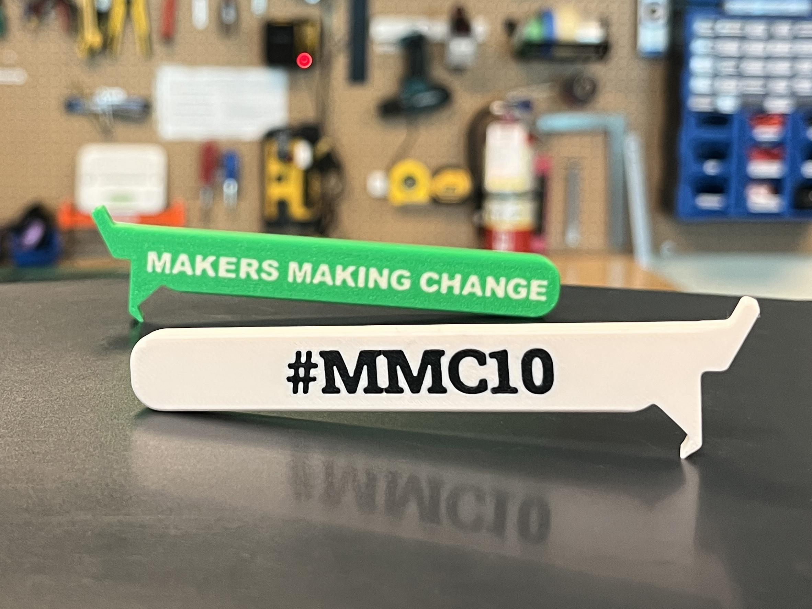

<!--- Open Source Assistive Technology: GitHub Readme Template Version 1.2 (2024-May-27)  --->

<!--- TITLE --->
# #MMC10 3D Printable Beverage Can Opener 

## Overview

Help us celebrate a decade of impact, innovation, and inclusion with this special open-source assistive device from Neil Squire's Makers Making Change program.
This repository features a 3D printable beverage opening aid, designed so more people can easily open canned drinks and participate fully in shared moments, whether that's a toast, a gathering, or a simple everyday activity.

The Beverage Can Opener is a simple, ergonomic tool that:
 - Hooks onto standard beverage can tabs
 - Provides leverage to reduce the force needed to open cans
 - Can be printed quickly using common materials (e.g., PLA)

This device requires:
 - 3D printed components only (no electronics required)
 - Minimal cost (typically just filament and print time)

This is a customized version of the [Beverage Can Opener](https://github.com/makersmakingchange/Beverage_Can_Opener) and is open assistive technology (OpenAT). Under the terms of the open source licenses, the device may be built, used, and improved upon by anyone.

The MMC10 Can Opener requires about $0.20 worth of material.

<!---
## How to Obtain the Device
### 1. Do-it-Yourself (DIY) or Do-it-Together (DIT)

This is an open-source assistive technology, so anyone is free to build it. All of the files and instructions required to build the device are contained within this repository. Refer to the Maker Guide below.

### 2. Request a build of this device

You may also submit a build request through the [Makers Making Change Assistive Device Library Listing](<MMCWebLink>) to have a volunteer maker build the device. As the requestor, you are responsible for reimbursing the maker for the cost of materials and any shipping.

### 3. Build this device for someone else

If you have the skills and equipment to build this device, and would like to donate your time to create the device for someone who needs it, visit the [MMC Maker Wanted](https://makersmakingchange.com/maker-wanted/) section.
--->

## Build Instructions

### 1. Read through the Maker Guide

The [Maker Guide](/Documentation/MMC10_Maker_Guide.pdf) contains all the necessary information to build this device, including tool lists, assembly instructions, programming instructions (if applicable) and testing.

### 3. Print the device

All of the 3D print files can be found in the [/Build_Files/3D_Printing_Files](/Build_Files/3D_Printing_Files/) folder.

## How to improve this Device
As open source assistive technology, you are welcomed and encouraged to improve upon the design. 

## Files

<!---
### Documentation
<!--- Update the name, link, and version for documentation --->
| Document             | Version | Link |
|----------------------|---------|------|
| Design Rationale     | 1.0     | [<Device_Name>_Design_Rationale](/Documentation/<Device_Name>_Design_Rationale.pdf)     |
| Maker Guide          | 1.0     | [<Device_Name>_Maker_Guide](/Documentation/<Device_Name>_Maker_Guide.pdf)     |
| Bill of Materials    | 1.0     | [<Device_Name>_Bill_of_Materials](/Documentation/<Device_Name>_BOM.xlsx)     |
| User Guide           | 1.0     | [<Device_Name>_User_Guide](/Documentation/<Device_Name>_User_Guide.pdf)    |
| Changelog            | 1.0     | [Changelog](CHANGES.txt)     |
--->
### Design Files
 - [CAD Files](/Design_Files/CAD_Design_Files)
 

### Build Files
 - [3D Printing Files](/Build_Files/3D_Printing_Files)

## License
Copyright (c) 2026. Neil Squire Society.

This repository describes Open Hardware:
 - Everything needed or used to design, make, test, or prepare the Beverage Can Opener is licensed under the [CERN 2.0 Weakly Reciprocal license (CERN-OHL-W v2) or later](https://cern.ch/cern-ohl ) .
  - Accompanying material such as instruction manuals, videos, and other copyrightable works that are useful but not necessary to design, make, test, or prepare the Beverage Can Opener are published under a [Creative Commons Attribution-ShareAlike 4.0 license (CC BY-SA 4.0)](https://creativecommons.org/licenses/by-sa/4.0/) .

You may redistribute and modify this documentation and make products using it under the terms of the [CERN-OHL-W v2](https://cern.ch/cern-ohl).
This documentation is distributed WITHOUT ANY EXPRESS OR IMPLIED WARRANTY, INCLUDING OF MERCHANTABILITY, SATISFACTORY QUALITY AND FITNESS FOR A PARTICULAR PURPOSE.
Please see the CERN-OHL-W v2 for applicable conditions.

Source Location: https://github.com/makersmakingchange/MMC10

## Attribution
<!--- Provide any necessary attribution for designs or components that are included in the device or as part of the project. --->
The original can opener design was created by Jason Yeung of [PrintLab](https://weareprintlab.com/) and released unders a CC BY-SA 4.0 license.

<!--- This is the attribution for the template. --->
The documentation template was created by Makers Making Change / Neil Squire Society and is available for use under a CC BY-SA 4.0 license. It is available at the following link: [https://github.com/makersmakingchange/OpenAT-Template](https://github.com/makersmakingchange/OpenAT-Template)

### Contributors
<!--- List the names of the people that contributed to the design. This could include the original source of the idea, designers, testers, documenters, etc. --->
 - Jason Yeung
 - Taz Oldaker
 - Jake McIvor
 - Kristina Mok
 - Josie Versloot
 
---
<!--- This is standard boilerplate for Makers Making Change. No changes should be required. --->
<!-- ABOUT MMC START -->
## About Makers Making Change

Makers Making Change is a program of [Neil Squire](https://www.neilsquire.ca/), a Canadian non-profit that uses technology, knowledge, and passion to empower people with disabilities.

Makers Making Change leverages the capacity of community based Makers, Disability Professionals and Volunteers to develop and deliver affordable Open Source Assistive Technologies.

 - Website: [www.MakersMakingChange.com](https://www.makersmakingchange.com/)
 - GitHub: [makersmakingchange](https://github.com/makersmakingchange)
 - Bluesky: [@makersmakingchange.bsky.social](https://bsky.app/profile/makersmakingchange.bsky.social)
 - Instagram: [@makersmakingchange](https://www.instagram.com/makersmakingchange)
 - Facebook: [makersmakechange](https://www.facebook.com/makersmakechange)
 - LinkedIn: [Neil Squire Society](https://www.linkedin.com/company/neil-squire-society/)
 - Thingiverse: [makersmakingchange](https://www.thingiverse.com/makersmakingchange/about)
 - Printables: [MakersMakingChange](https://www.printables.com/@MakersMakingChange)

### Contact Us
For technical questions, to get involved, or to share your experience we encourage you to [visit our website](https://www.makersmakingchange.com/) or [contact us](https://www.makersmakingchange.com/s/contact).
<!-- ABOUT MMC END -->
